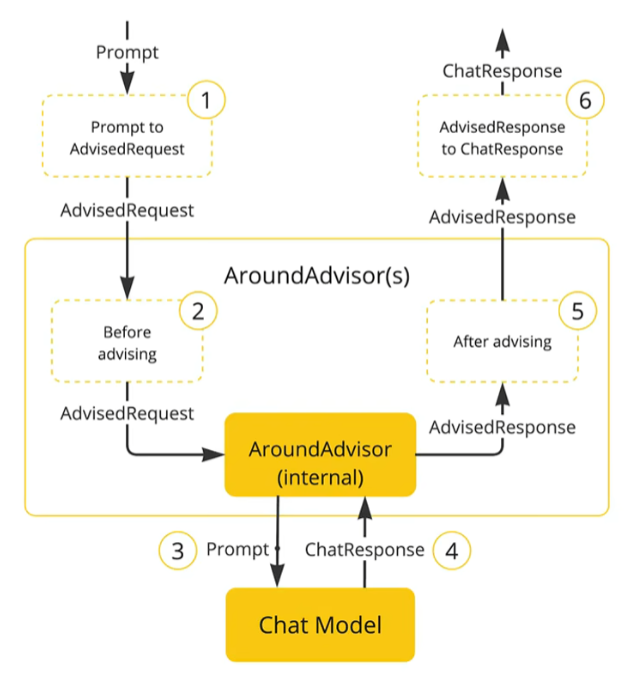
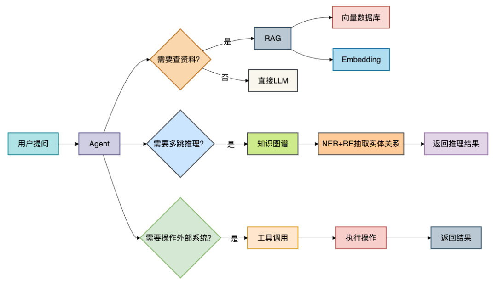

## SpringAI
### 快速搭建
- 第一步：引入依赖
```xml
<dependencyManagement>
    <!-- SpringAI的管理依赖 -->
    <dependencies>
        <dependency>
            <groupId>org.springframework.ai</groupId>
            <artifactId>spring-ai-bom</artifactId>
            <version>${spring-ai.version}</version>
            <type>pom</type>
            <scope>import</scope>
        </dependency>
    </dependencies>
</dependencyManagement>

<dependency>
    <groupId>org.springframework.ai</groupId>
    <artifactId>spring-ai-openai-spring-boot-starter</artifactId>
    <version>${spring-ai.version}</version>
</dependency>
```
- 第二步：配置模型
```yml
spring:
  application:
    name: spring-ai
  ai:
    openai:
#      base-url: 【你的AI接口调用地址】
#      api-key: 【你的AI key】
      # 本地Ollama
      base-url: http://localhost:11434
      # 本地Ollama 可以随便写，不为空就可以
      api-key: 123
      chat:
        options:
           # 【你的AI 模型】
#          model: deepseek-chat
#          temperature: 0.7
          # 本地Ollama配置
          model: deepseek-r1:1.5b
          # 值越大，输出结果越随机
          temperature: 0.7
```
- 第三步: 配置客户端
```java
@Configuration
public class ChatConfig {
    @Bean
    public ChatClient chatClient(OpenAiChatModel model){
        return ChatClient
                // 创建ChatClient工厂实例
                .builder(model)
                // 配置系统角色，可不配置
                .defaultSystem("你是一位公路行业专家，你的名字叫路文，请以公路专家的身份回答用户的问题")
                // 构建ChatClient实例
                .build();
    }
}
```
- 第四步: 构建会话
```java
@Slf4j
@RestController
@RequestMapping("/ai")
@RequiredArgsConstructor
public class ChatController {

    public final ChatClient chatClient;

    /**
     * 阻塞式：请求地址如（http://ip:port/ai/chat?message=你是谁?）
     */
    @RequestMapping("/chat")
    public String chat(@RequestParam("message") String message) {
        return chatClient.prompt()
                .user(message)
                .call()
                .content();
    }

    /**
     * 流式：请求地址如（http://ip:port/ai/chat-stream?message=你是谁?）
     *  声明produces = "text/html;charset=utf-8"以便输出结果乱码
     */
    @RequestMapping(value = "/chat-stream", produces = "text/html;charset=utf-8")
    public Flux<String> chatStream(@RequestParam("message") String message) {
        return chatClient.prompt()
                .user(message)
                .stream()
                .content();
    }
}
```
### 会话日志
- 原理
```
利用AOP原理提供AI会话时的拦截、增强等，即Advisor
```

- Spring提供的默认实现类
  - `SimpleLoggerAdvisor`：简易日志记录，在②和⑤执行，默认输出在控制台
  - `MessageChatMemoryAdvisor`：会话记忆
  - `QuestionAnswerAdvisor`：用于实现RAG功能
- `Advisor`的日志记录使用
    - 配置
    ```java
    import org.springframework.ai.chat.client.advisor.SimpleLoggerAdvisor;
    
    @Configuration
    public class ChatConfig {
        @Bean
        public ChatClient chatClient(OpenAiChatModel model) {
            return ChatClient
                    .builder(model)
                    .defaultSystem("你是一位公路行业专家，你的名字叫路文，请以公路专家的身份回答用户的问题")
    
                    // 配置日志Advisor
                    .defaultAdvisors(new SimpleLoggerAdvisor())
     
                    .build(); 
        }
    }
    ```
- 开启日志级别为Debug
  ```yaml
  logging:
    level:
      # 表示AI开启所有Advisor的debug级别的日志
      org.springframework.ai.chat.client.advisor: debug
  ```
### 会话记忆
 - 大模型不具备记忆功能，AI应用可以具备记忆功能，即应用将历史聊天的内容与新的提示词一起发送给大模型
 - 模型输入有三类角色：
   - `system`：优先于user指令之前的指令，也就是给大模型设定角色和任务背景的系统指令
   - `user`：终端用户输入的指令（即应用的输入）
   - `assistant`：由大模型生成的消息，可能是上一轮对话生成的结果
 - 实现会话记忆的步骤：
   - 定义会话存储方式
   ```java
    // Spring AI定义了标准的会话记忆，可以实现接口做会话持久化，提供了默认的InMemoryChatMemory实现类
    public interface ChatMemory {
   
        default void add(String conversationId, Message message) {
            this.add(conversationId, List.of(message));
        }
    
        void add(String conversationId, List<Message> messages);
    
        List<Message> get(String conversationId, int lastN);
    
        void clear(String conversationId);
    }
   
    // 创建Bean
    @Bean
    public ChatMemory chatMemory(){
        // 将会话内容保存到内存中
        return new InMemoryChatMemory();
    }
   ```
   - 配置会话记忆Advisor
    ```java
    import org.springframework.ai.chat.client.advisor.MessageChatMemoryAdvisor;import org.springframework.ai.chat.client.advisor.SimpleLoggerAdvisor;
    
    @Configuration
    public class ChatConfig {
        @Bean
        public ChatClient chatClient(OpenAiChatModel model, ChatMemory chatMemory) {
            return ChatClient
                    .builder(model)
                    .defaultSystem("你是一位公路行业专家，你的名字叫路文，请以公路专家的身份回答用户的问题")
    
                    // 配置Advisor
                    .defaultAdvisors(
                        new SimpleLoggerAdvisor(),
                        // 配置记忆Advisor
                        new MessageChatMemoryAdvisor(chatMemory)
                     )
                    .build(); 
        }
    }
    ```
   - 添加会话ID
   ```java
    @RequestMapping(value = "/chat-stream", produces = "text/html;charset=utf-8")
    public Flux<String> chatStream(String message, String chatId) {
        return chatClient.prompt()
            .user(message)
            // 添加会话ID到AdvisorContext上下文中
            .advisors(v -> v.param(AbstractChatMemoryAdvisor.CHAT_MEMORY_CONVERSATION_ID_KEY, chatId))
            .stream()
            .content();
    }
   ```
 ### AI术语关系
| 术语| 作用   | 输入 | 输出 | 典型应用|
|:--|:-----|:---|:---|:----|
LLM| 理解生成语言|文本|文本|聊天、写作
RAG|检索+生成|问题+知识库|有依据的答案|企业问答
Agent|自主执行任务|目标|行动结果|自动化
知识图谱|存储关系网络|结构化数据|推理路径|智能搜索
多模态|跨数据类型理解|文本+图像+音频|综合理解|自动驾驶
Fine-tuning|领域适配|小规模标注数据|定制模型|垂直领域AI
Embedding|语义向量化|文本/图像|向量数组|相似度计算
向量数据库|向量存储与检索|向量|相似向量|RAG、推荐
工具调用|执行外部操作|函数参数|执行结果|Agent行动
ReAct|思考-行动循环|任务目标|完成状态|智能体决策
NER|实体识别|文本|实体标签信|息抽取
RE|关系抽取|文本+实体|关系类型|知识图谱构建
文生图|生成图像|文本描述|图片|创意设计

### AI技术组合

#### 经典组合案例
- 企业智能助手
```
Agent（调度）+ RAG（查文档）+ LLM（生成答案）+ 工具调用（发邮件、创建工单）
```
- 医疗问诊系统
```
知识图谱（药品-疾病关系）+ NER（识别症状实体）+ RE（抽取症状-疾病关系）+ LLM（对话）
```
- 智能客服
```
RAG（FAQ检索）+ Agent（多轮对话）+ 工具调用（查询订单状态）
```
#### 总结
- `LLM`：大脑，负责理解和生成语言
- `RAG`：外挂知识库，让大脑能查资料
- `Agent`：手脚，让大脑能做事
- `知识图谱`：记忆网络，让大脑能推理关系
- `多模态`：感官，让大脑能看能听
- `Fine-tuning`：让通用模型变成领域专家
- `Embedding & 向量数据库`：实现语义搜索的基石
- `工具调用 & ReAct`：让AI真正“动手干活”
- `NER & RE`：从文本中构建知识图谱的利器
- `文生图/文生视频`：开启AI创作新时代