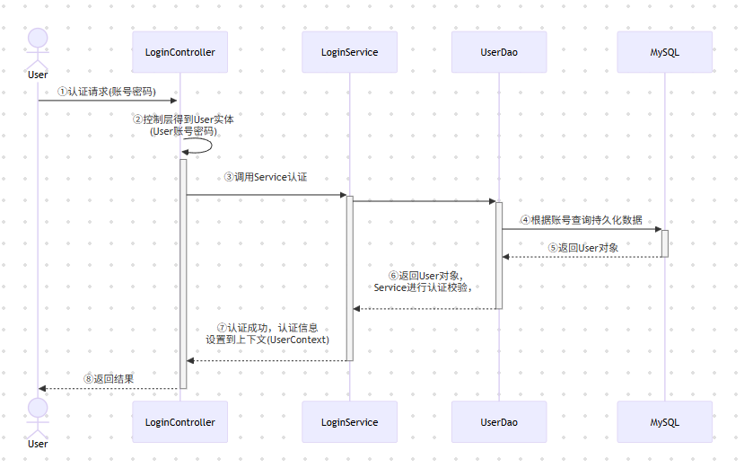

# OAuth2.0

--- 
## 一、SpringSecurity 认证
### 认证
对主体/用户身份的确认

### 授权
控制不同的用户访问不同的权限 ，用户认证成功后，就可以对某些资源进行访问， 但是不同的用户有不同的资源访问权利，那么对用户的授权也都不一样。授权的过程就是赋予不同用户不同权限的过程

### RBCA
基于角色的访问控制(Role-Based Access Control)，在 RBAC 中，权限与角色相关联，用户通过成为适当角色的成员而得到这些角色的权限；权限赋予给角色，而把角色又赋予用户。
RBAC 认为授权实际上是Who 、What 、How 三元组之间的关系，也就是Who 对What 进行How 的操作
- 主体（Who) ：权限的拥有者或主体（如：User，Role）
- 资源 (what)：操作或对象，如：页面，菜单，按钮，控制器(controller，hanler)等
- 权限(how) ：具体的权限， 如：新增、修改、删除

### 基于Session的认证
- 认证流程
    - ①用户提交认证请求
    - ②后端登录处理器（`LoginController`）接收登录信息，通过对应`LoginService`调用持久层`LoginDao`获取数据库用户信息并进行认证
    - ③认证成功，将用户认证信息`User`及对应的权限信息`Permission`设置到自定义上下文工具`SecurityContext`，存储到`Session`中
    - ④返回认证结果


- 认证检查流程
  - ①发起资源请求
  - ②判断`Session`是否有登录信息，通过`LoginCheckInterceptor`进行登录检查
  - ③如果登录信息不存在，返回错误信息；如果登录信息存在，进行第④步
  - ④返回访问资源


- 授权流程
`授权是约束用户对资源的访问权限。认证通过后，加载当前用户的权限列表进行权限检查`
  - ①发起资源请求
  - ②权限检查，通过`PermissionCheckInterceptor`访问`Session`中的用户权限信息进行校验
  - ③若无权限，返回错误信息；若有权限，进行第④步
  - ④返回访问资源

### 简易登录实现
SpringSecurity提供了一组可以在Spring应用上下文中配置的Bean，充分利用了Spring IoC，DI（控制反转Inversion of Control ,DI:Dependency Injection 依赖注入）和AOP（面向切面编程）功能，为应用系统提供声明式的安全访问控制功能
- 具体实现代码：
```java
// 只需配置WebSecurityConfig与编写控制器类SecurityAuthController即可实现，访问：http://localhost:8080/security
package com.duanjh.oauth2.security;
```
- 依赖项:
```xml
  <dependency>
    <groupId>org.springframework.boot</groupId>
    <artifactId>spring-boot-starter-security</artifactId>
  </dependency>
```
- 认证流程及原理

SpringSecurity是基于Filter实现认证和授权，底层通过FilterChainProxy代理去调用各种Filter(Filter链)，Filter通过调用AuthenticationManager完成认证，通过调用AccessDecisionManager完成授权
- 过滤器链

  `SecurityContextPersistenceFilter→UsernamePasswordAuthenticationFilter→BasicAuthenticationFilter→RememberAuthenticationFilter→ExceptionTranslationFilter→FilterSecurityInterceptor`
  - SecurityContextPersistenceFilter：Filter的入口和出口，用来将`SecurityContext`(认证的上下文，里面有登录成功后的认证授权信息)对象持久到Session的`Filter`，同时会把`SecurityContext`设置给`SecurityContextHolder`方便我们获取用户认证授权信息
  - UsernamePasswordAuthenticationFilter：默认拦截`/login`登录请求，处理表单提交的登录认证，将请求中的认证信息包括`username,password`等封装成`UsernamePasswordAuthenticationToken`，然后调用`AuthenticationManager`的认证方法进行认证
  - BasicAuthenticationFilter：基本认证，支持httpBasic认证方式的Filter
  - RememberAuthenticationFilter：记住我功能实现的Filter
  - AnonymousAuthenticationFilter：用来处理匿名访问的资源，如果用户未登录，SecurityContext中没有Authentication，就会创建匿名的Token(AnonymousAuthenticationToken),然后通过SecurityContextHodler设置到SecurityContext中
  - ExceptionTranslationFilter：用来捕获FilterChain所有的异常，进行处理，但是只会处理AuthenticationException和AccessDeniedException异常，其他的异常会继续抛出
  - FilterSecurityInterceptor：用来做授权的Filter,通过父类`(AbstractSecurityInterceptor.beforeInvocation)`调用`AccessDecisionManager.decide`方法对用户进行授权
- 相关类
  - Authentication：认证对象，用来封装用户的认证信息(账户状态，用户名，密码，权限等)，常用实现类：
    - UsernamePasswordAuthenticationToken：用户名密码登录的Token
    - AnonymousAuthenticationToken：针对匿名用户的Token
    - RememberMeAuthenticationToken：记住我功能的的Token
  - AuthenticationManager：用户认证的管理类，所有的认证请求（比如login）都会通过提交一个封装了到了登录信息的Token对象给`AuthenticationManager`的`authenticate()`方法来实现认证；认证成功后，返回一个包含了认 证
    信息的`Authentication`对象
  - AuthenticationProvider：认证的具体实现类，一个provider是一种认证方式的实现；主流的认证方式它都已经提供了默认实现，比如`DAO、LDAP、CAS、OAuth2`等。AuthenticationManager默认的实现类是ProviderManager
  - UserDetailService：用户的认证通过Provider来完成，而Provider会通过UserDetailService拿到数据库（或内存）中的认证信息然后和客户端提交的认证信息做校验
  - SecurityContext：通过认证之后，会为这个用户生成一个唯一的`SecurityContext`，里面包含用户的认证信息`Authentication`。通过`SecurityContext`我们可以获取到用户的标识`Principle`和授权信息`GrantedAuthrity`。在系统的任何地方只要通过`SecurityHolder.getSecruityContext()`就可以获取到`SecurityContext`
- 认证流程
  - 传统认证流程

    
  - SpringSecurity认证流程

    
    1. [x] **SecurityContext是一个和当前线程绑定的工具，在代码的任何地方都可以通过SecurityContextHolder.getContext()获取到登陆信息**
    - `SecurityContextPersistenceFilter`是整个filter链的入口和出口，请求开始会从SecurityContextRepository中 获取SecurityContext对象并设置给SecurityContextHolder。它的作用为：
      - 请求来的时候将包含了认证授权信息的SecurityContext对象从SecurityContextRepository中取出交给SecurityContextHolder工具类，方便我们通过SecurityContextHolder获取SecurityContext从而获取到认证授权信息
      - 请求走的时候又把SecurityContextHolder清空
      ```java
      public void doFilter(ServletRequest req, ServletResponse res, FilterChain chain) throws IOException, ServletException {
  
          HttpRequestResponseHolder holder = new HttpRequestResponseHolder(request, response);
          //从SecurityContextRepository获取到SecurityContext 
          SecurityContext contextBeforeChainExecution = repo.loadContext(holder);
  
          try {
              //把 securityContext设置到SecurityContextHolder，如果没认证通过，这个SecurtyContext就是空的
              SecurityContextHolder.setContext(contextBeforeChainExecution);
              //调用后面的filter，比如掉用usernamepasswordAuthenticationFilter实现认证
              chain.doFilter(holder.getRequest(), holder.getResponse());
          }finally {
              //如果认证通过了，这里可以从SecurityContextHolder.getContext();中获取到SecurityContext
              SecurityContext contextAfterChainExecution = SecurityContextHolder.getContext();
              //删除SecurityContextHolder中的SecurityContext 
              SecurityContextHolder.clearContext();
              //把SecurityContext 存储到SecurityContextRepository
              repo.saveContext(contextAfterChainExecution, holder.getRequest(),holder.getResponse());
              request.removeAttribute(FILTER_APPLIED);
              if (debug) {
                  logger.debug("SecurityContextHolder now cleared, as request processing completed");
              }
          }
      }
      ```
    - `UsernamePasswordAuthenticationFilter`是拦截“/login”登录请求，处理表单提交的登录认证，将请求中的认证信息包括`username,password`等封装成UsernamePasswordAuthenticationToken，然后调用AuthenticationManager的认证方法进行认证；后面认证成功，请求会重新回到UsernamePasswordAuthenticationFilter，然后会通过其父类AbstractAuthenticationProcessingFilter.successfulAuthentication方法将认证对象封装成SecurityContext设置到SecurityContextHolder中，后续请求又会回到SecurityContextPersistenceFilter
    - `AuthenticationManager`默认走的实现类是ProviderManager，它会找到能支持当前认证的AuthenticationProvider实现类调用器authenticate方法执行认证，认证成功后会清除密码，然后抛出AuthenticationSuccessEvent事件
    - `DaoAuthenticationProvider`是根据传入的Token中的username调用UserDetailService加载数据库中的认证授权信息(UserDetails)，然后使用PasswordEncoder对比用户登录密码是否正确。真正的认证逻辑是通过父类AbstractUserDetailsAuthenticationProvider.authenticate方法完成的
      - `additionalAuthenticationChecks`:通过passwordEncoder比对密码
      - `retrieveUser`:根据用户名调用UserDetailsService加载用户认证授权信息
      - `createSuccessAuthentication`:登录成功，创建认证对象Authentication
  - 在SpringSecurity的整个认证流程中，除了UserDetailsService需要我们自己定义外，其他的的组件都可以使用默认的
- 授权流程

  授权流程是通过`FilterSecurityInterceptor`拦截器来完成，FilterSecurityInterceptor通过调用SecurityMetadataSource来获取当前访问的资源所需要的权限，然后通过调用AccessDecisionManager投票决定当前用户是否有权限访问当前资源
  - 流程：
    - ①客户端向某个资源发起请求，请求到达FilterSecurityInterceptor，然后会调用其父类AbstractSecurityInterceptor的beforeInvocation方法做授权之前的准备工作
    - ②在beforeInvocation法中通过`SecurityMetadataSource…getAttributes(object)`获得资源所需要的访问权限，通过`SecurityContextHolder.getContext().getAuthentication()`获取当前认证用户的认证信息
    - ③然后FilterSecurityInterceptor通过调用AccessDecisionManager.decide(authenticated,object,attributes)进行授权，使用投票器投票来决定用户是否有资源访问权限
    - ④投票通过，请求放行，响应对应的资源给客户端
  - AccessDecisionManager接口有三个实现类，通过`AccessDecisionVoter`投票器完成投票，三种投票策略如下：
    - `AffirmativeBased`: 只需有一个投票赞成即可通过
    - `ConsensusBased`：需要大多数投票赞成即可通过，平票可以配置
    - `UnanimousBased`：需要所有的投票赞成才能通过
  - 还可以通过`RoleVoter、AuthenticatedVoter`完成投票，`RoleVoter`处理ConfigAttribute是以“ROLE_”开头的，`AuthenticatedVoter`用来区分匿名用户与通过Remember-Me认证的用户和完全认证的用户(登录后的)
- HttpSecurity授权Api：
  - `anyRequest()`: 任意请求
  - `requestMatchers(String ...patterns)`：匹配某些资源路径
  - `authenticated()`：保护URL访问需要登录后
  - `permitAll()`：指定URL可直接访问
  - `hasRole(String role)`：资源需要用户拥有什么样的role才能访问
  - `hasAuthority(String authority)`：资源需要用户拥有什么样的权限才能访问
  - `hasAnyRole(String …roles)`：资源拥有指定角色中的一个就能访问
  - `hasAnyAuthority(String … authorities)`：资源拥有指定权限中的一个就能访问
  - `access(String attribute)`：该方法使用SPEL表达式,可以创建复杂的限制
- Web授权
  - 配置HttpSecurity
    ```
    ...
    .authorizeHttpRequests(request -> {
      // 从权限表查询出了所有的资源并进行一一授权,指定哪个资源需要哪个权限才能访问
      if(CollectionUtils.isNotEmpty(permissions)){
        // 权限
        permissions.stream().forEach(p -> {
          request.requestMatchers(p.getResource()).hasAuthority(p.getSn());
        });
      }
      request.anyRequest().authenticated();
    })
    ```
  - 配置UserDetailService
    ```
     // 加载权限：加载用户认证信息的时候就把用户的权限信息一并加载
     List<GrantedAuthority> permissions = new ArrayList<>();
     List<Permission> authorizeds = permissionRepository.findPermissionsByUserId(login.getId());
     if(CollectionUtils.isNotEmpty(authorizeds)){
        authorizeds.stream().forEach(v -> {
            permissions.add(new SimpleGrantedAuthority(v.getSn()));
        });
     }
    ``` 
- 方法授权
  - `@Secured`：标记方法需要有什么样的权限才能访问，这个注解需要在配置类上开启授权注解`@EnableGlobalMethodSecurity(securedEnabled=true)`支持
    - `@Secured(“IS_AUTHENTICATED_ANONYMOUSLY”)`：方法可以匿名访问
    - `@Secured(“ROLE_DEPT”)`： 需要拥有部门的角色才能访问，`ROLE_`前缀是固定的
    - `@Secured`注解授权是需要加上前缀`ROLE_`
  ```
  @Configuration
  @EnableWebSecurity
  @EnableGlobalMethodSecurity(securedEnabled=true)
  public class WebSecurityConfig  {
    ...
  }
  
  
  @ResponseBody
  @Secured("ROLE_data:all")   // 表示当前资源需要“ROLE_data:all”权限才能访问
  @RequestMapping("/data/all")
  public String all(){
      return "data.all";
  }
  ```
  - `@PreAuthorize`：适合进入方法前的权限验证，拥有和Secured同样的功能，甚至更强大，该注解需要在配置类开启`@EanbleGlobalMethodSecurity(prePostEnabled=true)`方法授权支持
    - `@PreAuthorize("isAnonymous()")`：方法匿名访问
    - `@PreAuthorize("hasAnyAuthority('data:list','user:list')")`：拥有`data:list`或者`user:list`的权限能访问
    - `@PreAuthorize("hasAuthority('data:del') and hasAuthority('user:view')")` : 拥有`data:del`权限和`user:view`权限才能访问
    - 该标签不需要有固定的前缀
    ```
    @Configuration
    @EnableWebSecurity
    @EnableGlobalMethodSecurity(
        prePostEnabled = true   // 启用@PreAuthorize
    )
    public class WebSecurityConfig  {
        ....
    }
    
    
    @ResponseBody
    @PreAuthorize("hasAnyAuthority('data:add','data:edit')")    //指明了方法必须要有 data:add 或者 data:edit的权限才能访问
    @RequestMapping("/data/edit")
    public String edit(){
        return "data.edit";
    }
    ```
  - `@PostAuthorize`：不常用，适合在方法执行后再进行权限验证，使用该注解需要在配置类开启`@EanbleGlobalMethodSecurity(prePostEnabled=true)`方法授权支持
- 认证结果处理
  - 在前后端分离的项目通常是使用Ajax请求完成认证，需要返回一个JSON结果告知前端认证结果，然后前端自行跳转页面，需要做以下开发
    - 实现处理器
      - 认证成功（`AuthenticationSuccessHandler`）：复写`onAuthenticationSuccess`方法，其中一个参数`Authentication`封装了认证信息、用户信息`UserDetails`
      - 认证失败
    - 在配置中配置自定义处理器
    ```
        // 设置登录成功页，如果使用的是自定义AuthenticationSuccessHandler返回json格式，需要将这个注释掉
        // formLogin.defaultSuccessUrl("/home");

        // 成功处理：自定义AuthenticationSuccessHandler处理器处理返回JSON数据
        formLogin.successHandler(new PersonalAuthorizationHandler());
        // 失败处理
        formLogin.failureHandler(new PersonalAuthorizationFailureHandler());
    ```
- 授权结果处理：当认证或授权检查失败，需要返回自己的失败结果信息时，可通过`HttpSecurity`设置授权失败结果处理器,内部通过`ExceptionTranslationFilter`调用`AuthenticationEntryPoint`实现匿名用户授权失败结果处理，`ExceptionTranslationFilter`通过`AccessDeniedHandler`来处理授权失败结果处理
  - 定义`AccessDeineHandler`用来解决认证过的用户访问无权限资源时的异常
  - `AuthenticationEntryPoint`用来解决匿名用户访问无权限资源时的异常
  - 异常处理器配置
  ```
  httpSecurity.
  ...
  .exceptionHandling(resolver -> {
      resolver.accessDeniedHandler(new AccessDeniedHandler() {
          @Override
          public void handle(HttpServletRequest request, HttpServletResponse response, AccessDeniedException accessDeniedException) throws IOException, ServletException {
              log.info("此处写解决认证过的用户访问无权限资源时的异常的处理");
          }
      }).authenticationEntryPoint(new AuthenticationEntryPoint() {
          @Override
          public void commence(HttpServletRequest request, HttpServletResponse response, AuthenticationException authException) throws IOException, ServletException {
              log.info("此处写解决认证过的用户访问无权限资源时的异常的处理");
          }
      });
  })
  ...
  .build();
  ```
### 记住密码功能
- 核心流程
  - 用户发起登录勾选了记住我，在一定的时间内再次访问该网站会默认登录成功，即使浏览器退出重新打开也是如此，这个功能需要借助浏览器的cookie实现
  - 核心流程
  
    - 认证成功`UsernamePasswordAuthenticationFilter`会调用`RememberMeServices`创建`Token`，同时`RemeberMeService`会调用`TokenRepository`将`Token`写入数据库持久化,然后`RemeberMeService`通过`Reponse.addCookie`把`Token`写到浏览器的`Cookies`中
    - 当浏览器再次发起请求会进入`RemeberMeAuthenticationFilter`，将请求中获取到的`token`交给`RemeberMeService`
    - `RemeberMeService`调用`TokenRepository`去数据库中根据`Token`查询用户名
    - 调用`UserDetilasService.loadUserByUsername`根据用户名获取用户认证信息
    - 通过`authenticationManager.authenticate`，做一次认证，然后把用户信息放入上下文对象中
- 功能实现
  - 在`WebSecurityConfig`中配置`TokenRepository`
  ```
    @Bean
    public PersistentTokenRepository persistentTokenRepository() {
        JdbcTokenRepositoryImpl tokenRepository = new JdbcTokenRepositoryImpl();
        tokenRepository.setDataSource(context.getBean(DataSource.class));
        // 启动创建persistent_logs表，首次启动时可设置true，后面必须设置false，也可直接自行创建表
        //tokenRepository.setCreateTableOnStartup(true);
        return tokenRepository;
    }
  
    // 表persistent_logs
    CREATE TABLE persistent_logins (
      username varchar(64) NOT NULL COMMENT '用户登录名',
      series varchar(64) NOT NULL COMMENT,
      token varchar(64) NOT NULL COMMENT '用户登录Token',
      last_used timestamp NOT NULL DEFAULT CURRENT_TIMESTAMP ON UPDATE CURRENT_TIMESTAMP,
      PRIMARY KEY (series)
    ) ENGINE=InnoDB DEFAULT CHARSET=utf8mb4;
  ```
  - 配置`RememberMe`：修改认证服务配置`WebSecurityConfig`的`HttpSecurity`配置，增加rememberMe
  ```
  httpSecurity.
  ...
  // 配置Remember Me
  .rememberMe(rmc -> {
      // 持久化
      rmc.tokenRepository(persistentTokenRepository())
          // 过期时间，设置3600秒，即1小时
          .tokenValiditySeconds(3600)
          // 用于加载用户认证信息
          .userDetailsService(userDetailService);

  })
  ```
  - 访问登录页面进行登录，勾选记住我；登录成功后，退出浏览器；重新打开浏览器，直接访问资源-不需要登录就能访问；如果你观察浏览器的cookie会发现一个Token，该Token和persistent_logins中存储的Token对应
---
## 二、SpringCloud+Security+Oauth2
在微服务架构下有很多的服务，每个微应用都需要对访问进行认证检查和权限控制，客户端发起一个请求需要考虑如何让用户的认证状态通知到所有的微服务中，尤其是请求来源于多种客户端如浏览器，移动端，三方程序，服务之间访问时，微服务的授权变得更加麻烦，再加上本地Session在微服务(集群/分布式)环境中存在Session不同步的问题
### 微服务(分布式)授权方案
#### CAS单点登录
#### 分布式Session+网关
#### 客户端Token+网关
#### 其他方案
#### OAuth2