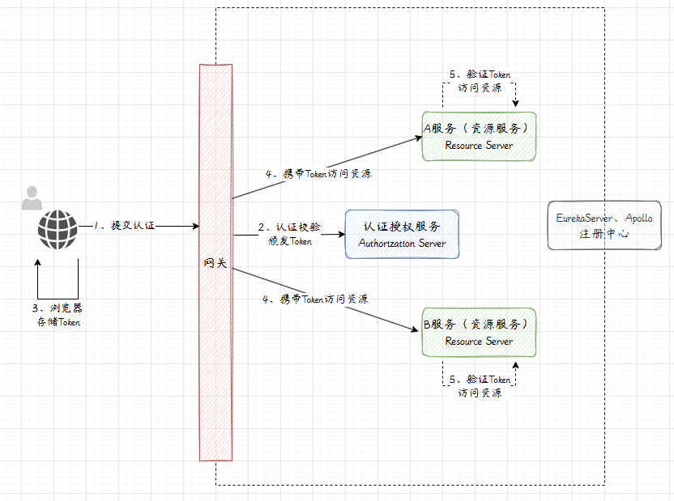

# SpringCloud+Security+Oauth2
## 一、环境准备
### ①介绍
`SpingSecurity Oauth2`实现了`Oatuh2`，`SpingSecurity Oauth2`分为两个大块，一者为认证授权`(Authorization Server)`服务和资源服务`(Resource server)`
- 认证授权服务：负责执行认证逻辑(登录)和加载用户的权限(给用户授权)，以及认证成功后的令牌颁发
- 资源服务：一般指的是我们系统中的微服务(被访问的微服务)，在资源服务器需要对用户的令牌(认证成功与否)，以及授权(是不是有访问权限)做检查
### ②解决方案
需要准备四个服务及服务流程
- 1.授权服务
- 2.资源服务
- 3.网关
- 4注册中心

