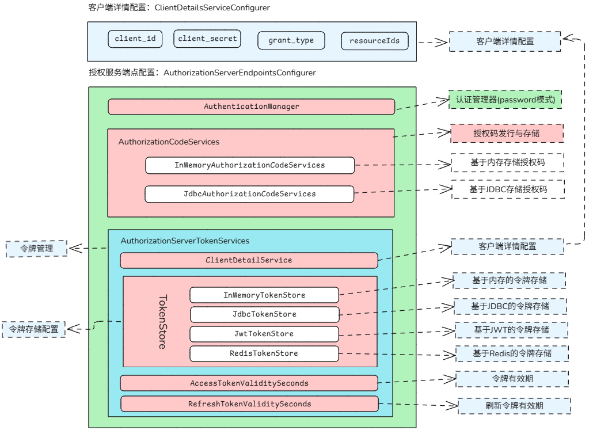
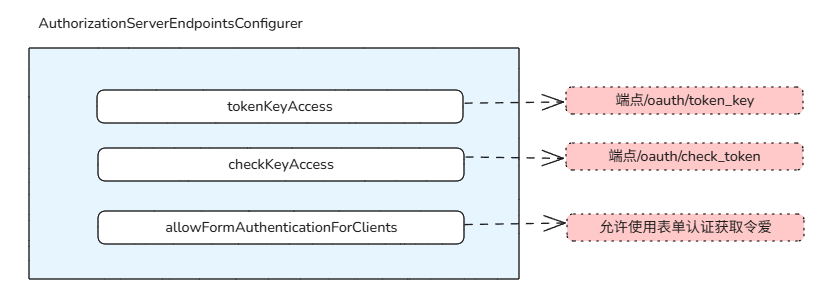
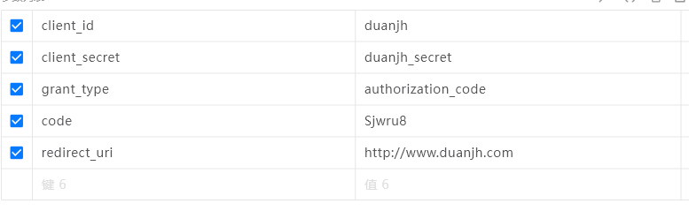
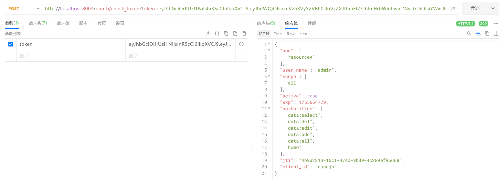
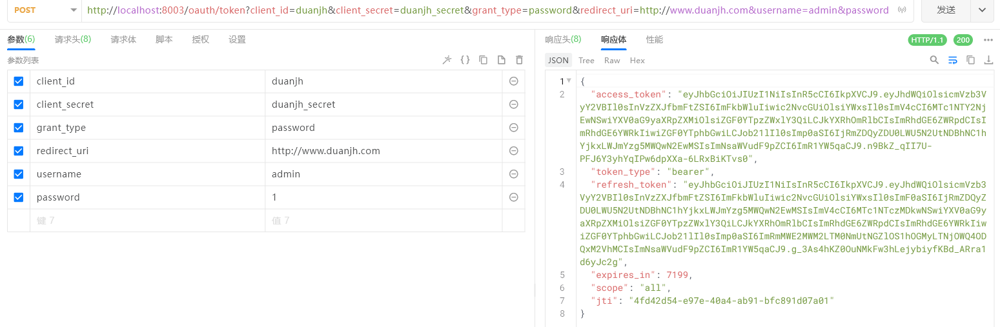

# 统一认证微服务
## 授权服务配置
### 概述
- 引入依赖即可集成JWT和Oauth2
```xml
<!-- Oauth2和Security -->
<dependency>
  <groupId>org.springframework.cloud</groupId>
  <artifactId>spring-cloud-starter-oauth2</artifactId>
</dependency>
```
- Oauth2提供了AuthorizationServerConfigurerAdapter适配器类来作为认证授权服务的配置
```java
public class AuthorizationServerConfigurerAdapter  {
    
    //客户端详情：配置客户端请求的参数
	public void configure(ClientDetailsServiceConfigurer clients);
    
	//授权服务断点：配置授权码和令牌的管理/存储方式
	public void configure(AuthorizationServerEndpointsConfigurer endpoints);
    
    //授权服务安全配置：配置哪些路径放行(检查token的路径要放行)
	public void configure(AuthorizationServerSecurityConfigurer security);
    
}
```
- `ClientDetailsServiceConfigurer `：用来配置客户端详情服务，如配置客户端id(client_id)资源id、客户端密钥(secrect)、授权方式、scope等,可以基于内存或jdbc；其实就是对客户端的参数配置，在客户端获取授权码或者获取Token的URL请求中就需要带上这些客户端参数
    ```
    // 获取授权码
    端点：
        /oauth/authorize?
    参数：
        client_id=duanjh&response_type=code&redirect_uri=www.duanjh.com/serviceA
   
   // 获取令牌 
   端点：
        POST /oauth/token?
    参数：
        client_id=duanjh&client_secret=secret&grant_type=authorization_code&code=GTijFMsT&redirect_uri=www.duanjh.com/serviceA
   ```
 - `AuthorizationServerEndpointsConfigurer`：配置令牌的访问端点url和令牌服务，如配置如何管理授权码(内存或jdbc)，如何管理令牌(存储方式，有效时间等等)
 - `AuthorizationServerSecurityConfigurer`：用来配置令牌端点的安全约束，如配置对获取授权码、检查token等某些路径进行放行
- 授权服务配置

- 授权服务器安全配置

## 服务配置
### 客户端配置
通过`ClientDetailsServiceConfigurer`配置客户端详情，定义配置类，继承`AuthorizationServerConfigurerAdapter`，复写第一个`configure`方法，配置类上贴注解`@EnableAuthorizationServer`开启授权服务配置
```java
@Configuration
@EnableAuthorizationServer
public class AuthorizationServerConfig extends AuthorizationServerConfigurerAdapter {

    /**
     * 密码编码器
     */
    @Autowired
    private PasswordEncoder passwordEncoder;

    @Autowired
    private DataSource dataSource;

    /*------------------------------------ 客户端详情配置 --------------------------------------------*/
    @Bean
    public ClientDetailsService clientDetailsService() {

      /**
       * 默认会去找数据库中的名字为oauth_client_details 表中的数据作为客户端详情的配置
       * DROP TABLE IF EXISTS oauth_client_details;
       * CREATE TABLE oauth_client_details (
       *  client_id varchar(48) NOT NULL,
       *  resource_ids varchar(256) DEFAULT NULL,
       *  client_secret varchar(256) DEFAULT NULL,
       *  scope varchar(256) DEFAULT NULL,
       *  authorized_grant_types varchar(256) DEFAULT NULL,
       *  web_server_redirect_uri varchar(256) DEFAULT NULL,
       *  authorities varchar(256) DEFAULT NULL,
       *  access_token_validity int(11) DEFAULT NULL,
       *  refresh_token_validity int(11) DEFAULT NULL,
       *  additional_information varchar(4096) DEFAULT NULL,
       *  autoapprove varchar(256) DEFAULT NULL,
       *  PRIMARY KEY (client_id)
       *  ) ENGINE=InnoDB DEFAULT CHARSET=utf8mb4;
       */
      JdbcClientDetailsService clientDetailsService = new JdbcClientDetailsService(dataSource);
        // 设置密码编码器
        clientDetailsService.setPasswordEncoder(passwordEncoder);

        return clientDetailsService;
    }

    // 基于JDBC的客户端详情配置
    @Override
    public void configure(ClientDetailsServiceConfigurer clients) throws Exception {
        clients.withClientDetails(clientDetailsService());
    }
}
```
- 数据库中的`client_secret`需要是密文加密的，加密如:`BCrypt.hashpw("duanjh", BCrypt.gensalt())`，明文为`duanjh`
- 关于`oauth_client_details`：
  - `client_id（即app_key）`：主键，必须唯一。用于唯一标识每一个客户端(client)；注册时必须填写(也可以服务端自动生成)
  - `resource_ids`：资源ID，不能为空。客户端能访问的资源id集合，注册客户端时，根据实际需要可选择资源id，也可以根据不同的额注册流程，赋予对应的额资源id，如：`data-service、display-service`
  - `client_secret（即app_secret）`：客户端秘钥，不能为空。注册填写或者服务端自动生成, 必须要有前缀代表加密方式，如：`{bcrypt}gY/WkSfQ5tuqJZTneC4FaYbVMa2rNRxeTxhEQZ`
  - `scope`：授权范围，不可为空。指定客户端（client）的权限范围，比如PC与mobile权限、读写权限`（pc,mobile）、(read,write)`
  - `authorized_grant_types`：授权方式，不可为空。可选值如下，支持多个用逗号分隔：
    - 授权码模式`authorization_code`
    - 密码模式`password`
    - 刷新token`refresh_token`
    - 隐式模式`implicit`
    - 客户端模式`client_credentials`
  - `web_server_redirect_uri`：客户端重定向uri。authorization_code和implicit需要该值进行校验，注册时填写
  - `authorities`：权限，可为空。指定用户的权限范围，如果授权的过程需要用户登陆，该字段不生效，implicit和client_credentials需要，如：`ROLE_ADMIN,ROLE_USER`
  - `access_token_validity`：Token有效期，可空。access_token的有效时间(秒)，默认(60*60*12, 即12小时)
  - `refresh_token_validity`：刷新Token有效时期，可空。refresh_token有效期(秒)，默认(60*60*24*30, 30天)
  - `additional_information`：附加数据，可空。值必须是json格式，如`{"key", "value"}`
  - `autoapprove`：是否默认授权，默认`false`。适用于authorization_code模式，设置用户是否自动approval操作，设置true跳过用户确认授权操作页面，直接跳到redirect_uri
### 服务配置
通过`AuthorizationServerEndpointsConfigurer`配置授权码和令牌相关的服务,在上面的配置类基础上增加配置内容
```java
/*------------------------------------ 令牌服务配置 --------------------------------------------*/

/**
 * 认证管理器，需要配置
 */
@Autowired
AuthenticationManager authenticationManager;

// JWT令牌校验工具
@Bean
public JwtAccessTokenConverter jwtAccessTokenConverter() {

    JwtAccessTokenConverter converter = new JwtAccessTokenConverter();

    // 设置JWT签名密钥：可以是简单的MAC密钥，也可以是RSA密钥
    converter.setSigningKey("duanjh");

    return converter;
}

//令牌存储，基于JWT
@Bean
public TokenStore tokenStore(){
    return new JwtTokenStore(jwtAccessTokenConverter());
}

// 配置令牌服务
@Bean
public AuthorizationServerTokenServices tokenServices() {

    //创建默认令牌服务
    DefaultTokenServices tokenServices = new DefaultTokenServices();

    // 指定客户端详情配置
    tokenServices.setClientDetailsService(clientDetailsService());

    // 支持刷新token
    tokenServices.setSupportRefreshToken(true);

    // token存储方式
    tokenServices.setTokenStore(tokenStore());

    // 设置token增强
    TokenEnhancerChain tokenEnhancerChain = new TokenEnhancerChain();
    tokenEnhancerChain.setTokenEnhancers(Arrays.asList(jwtAccessTokenConverter()));

    tokenServices.setTokenEnhancer(tokenEnhancerChain);

    // 设置token有效期：5分钟
    tokenServices.setAccessTokenValiditySeconds(60*60*5);

    //刷新令牌默认有效时间
    tokenServices.setRefreshTokenValiditySeconds(60*60*5);

    return tokenServices;
}

/**
 * 授权码服务
 */
@Bean
public AuthorizationCodeServices authorizationCodeServices() {
    return new JdbcAuthorizationCodeServices(dataSource);
}

/**
 * 配置令牌访问端点
 */
@Override
public void configure(AuthorizationServerEndpointsConfigurer endpoints) throws Exception {
    endpoints
            // 密码模式需要
            .authenticationManager(authenticationManager)
            // 授权码模式服务
            .authorizationCodeServices(authorizationCodeServices())
            // 配置令牌管理服务
            .tokenServices(tokenServices())
            // 允许POST请求
            .allowedTokenEndpointRequestMethods(HttpMethod.POST);
}
```
- `AuthenticationManager`：认证管理器`password`模式会用到认证管理器
- `TokenStore`：token存储方式。常用的实现有
  - `InMemoryTokenStore`：基于内存的token存储方案
  - `JdbcTokenStore`：基于数据库的token存储方案
  - `JwtToeknStore`：基于JWT的存储方案
  - `RedisTokenStore`：基于Redis的存储方案
- `JwtAccessTokenConverter`：JWT令牌转换器，JWT编码的令牌值和OAuth身份验证信息（双向）之间转换器 ，`SigningKey`设置的是秘钥
- `AuthorizationCodeServices`：授权码服务，提供了基于内存`InMemoryAuthorizationCodeServices`和基于数据库`JdbcAuthorizationCodeServices`的授权码存储方案
  - 基于JDBC那么我们需要提供存储授权码的表`oauth_code`
  ```mysql
  DROP TABLE IF EXISTS oauth_code;
  CREATE TABLE oauth_code (
  code varchar(255) DEFAULT NULL COMMENT '授权码(未加密)',
  authentication varbinary(5000) DEFAULT NULL COMMENT 'AuthorizationRequestHolder.java对象序列化后的二进制数据'
  ) ENGINE=InnoDB DEFAULT CHARSET=utf8mb4;
  ```
- `AuthorizationServerTokenServices`：用来配置授权服务器令牌，如配置是否支持Token，Token的存储方式(内存、jdbc)、token加密、token过期等
### 令牌端点安全配置
通过AuthorizationServerSecurityConfigurer来配置令牌端点的安全策略
```java
/*------------------------------------ 端点安全约束：配置令牌安全约束 --------------------------------------------*/

@Override
public void configure(AuthorizationServerSecurityConfigurer security) throws Exception {
  security
          // 对应 /oauth/token_key 公开，获取公钥需要访问该端点
          .tokenKeyAccess("permitAll()")
          // 对应/oauth/check_token 路径公开，校验Token需要请求该端点
          .checkTokenAccess("permitAll()")
          // 允许客户端进行表单身份验证,使用表单认证申请令牌
          .allowFormAuthenticationForClients();
}
```
### 授权服务测试
- 登录认证:`http://localhost:8003`，输入账号密码登录
- 获取授权码：`http://localhost:8003/oauth/authorize?client_id=duanjh&response_type=code&redirect_uri=http://www.duanjh.com`
- 获取令牌
  - 请求地址：`http://localhost:8003/oauth/token`
    - 请求方式：`POST`
    - 请求头：`Content-Type`: `application/x-www-form-urlencoded`
    - 请求参数：
      
- 令牌检查：`http://localhost:8003/oauth/check_token`
  - 请求方式：`POST`
  - 请求参数：获取的令牌`token`
  
    - `aud`：里面包含的是`token可访问的资源ID`
    - `scope`：里面包含的是`token可访问的授权范围`，这是因为我们在获取Token的时候指定了client_id=duanjh，它对应了oauth_client_details表中的客户端详情配置，所以Token拥有的资源ID和授权范围都是根据client_id 加载的对应的客户端详情配置
    - `user_name`：`token对应的用户`，也是因为在获取Token的时候使用了账号和密码进行认证
    - `authorizes`：`token对应的用户的权限列表`，是在获取Token的时候，Security会执行认证流程，根据用户名调用UserDeatilsService加载的权限
    - `client_id`：`对应的客户端ID`
    - **注意：Token的 scope授权范围，aud资源ID，以及authorities 权限列表三者决定了这个Token是否能够去访问某个资源服务器**
- 密码授权模式
  - 密码模式不需要获取授权码
  - 请求地址：`http://localhost:8003/oauth/token`
    - 请求方式：`POST`
    - 请求头：`Content-Type`: `application/x-www-form-urlencoded`
    - 请求参数
    
- token刷新
- 带着之前获取Token返回的刷新token的值`即refresh_token的值`访问如下地址即可刷新
- `refresh_token`为获取token是返回值
`http://localhost:8003/oauth/token?grant_type=refresh_token&refresh_token=刷新Token值&client_id=duanjh&client_secret=secretValue`
## 授权服务配置整体情况
- 集成Security和JPA能够实现用户的认证
- 集成Oauth2做授权服务配置，主要做了三个配置
  - 基于JDBC的客户端详情配置，加载oauth_client_details表中的配置
  - 基于JDBC的授权码配置和基于JWT的Token配置
  - 最后做了授权服务端点的安全配置
- 请求抵达认证服务器`auth-server`后的流程
- 第一步（登录认证）：执行登录操作，Security会调用AuthenticationManager执行认证，调用UserDeatilsService加载数据库中的用户信息和权限列表保持到上下文对象中
- 第二步（授权码请求）：发起一个获取授权码的请求`/oauth/authorize?client_id=duanjh&response_type=code&redirect_uri=http://www.duanjh.com`，请求到达认证服务器
- 第三步（返回授权码）：认证服务器收到请求，为请求生成授权码，并返回给请求中指定的重定向地址
- 第四步（TOKEN请求）：带着`授权码`去获取token，请求`/oauth/token?lient_id=duanjh&client_secret=secret&grant_type=authorization_code&code=授权码`，请求到达认证服务器
- 第五步（颁发TOKEN）：认证服务器收到请求，验证授权码后，根据client_id从oauth_client_details表加载客户端配置进行参数校验，然后认证服务器创建令牌，颁发给客户端
- 第六步（TOKEN校验）：通过`/oauth/check_token`检查`token`时，就可以看到`token对应的授权范围，资源ID，权限列表`等信息，认证服务器在生成token的时候，就已经把这些信息关联好