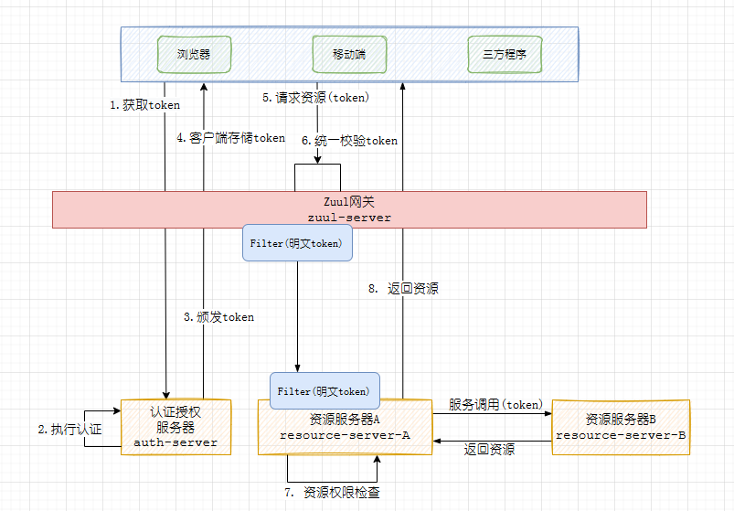

# 网关
微服务统一访问入口，实现统一鉴权操作
## 统一鉴权方案
微服务中有两种授权方案：
- 一者是不使用网关，即鉴权工作交给资源服务器。需要在每个资源服务做同样的资源服务配置
- 二者是使用网关统一鉴权。需要把资源服务的配置搬到网关中实现统一鉴权(网关充当了资源服务器实现鉴权功能)

**注意**：当网关实现了统一鉴权那么下游的资源服务器就不再需要做Oauth2鉴权的工作了，只需要基于WebSecurity做对具体资源的授权即可，要注意的是既然zuul校验了Token那它就可以获取到Token中的明文的认证授权信息，那么zuul只需要使用Filter把明文数据(明文Token)通过Header转发给下游资源服务即可，不再转发密文的Token，而下游资源服务也需要需要使用Filter接收Header中的`明文Token`

- zuul负责的统一鉴权、检查Token的合法性；下游被调用的资源服务器负责对具体的资源进行授权
## Zuul的OAuth2配置
### 导入OAuth2的依赖
```xml
<dependency>
    <groupId>org.springframework.cloud</groupId>
    <artifactId>spring-cloud-starter-oauth2</artifactId>
</dependency>
```
### 资源服务配置
Zuul需要统一鉴权，需要进行OAuth2配置，例如：配置了两个资源服务，一个针对于auth-server微服务的的资源配置`ResourceServerConfig`；一个是针对于resource-server微服务的资源配置`ResourceAConfig`
- `auth-server`配置
```java
@Configuration
//开启资源服务配置
@EnableResourceServer
// 启用@PreAuthorize
@EnableGlobalMethodSecurity(prePostEnabled = true)
public class ResourceServerConfig extends ResourceServerConfigurerAdapter {

    /**
     * 配置资源id ,对应oauth_client_details表中配置的resourceIds
     * 一个资源ID可以对应一个资源服务器，如果Token中不包含该资源ID就无法访问该资源服务器
     */
    public static final String RESOURCE_ID = "resource-server-A";

    @Bean
    public TokenStore tokenStore() {
        return new JwtTokenStore(accessTokenConverter());
    }

    /**
     * JWT令牌校验工具
     */
    @Bean
    public JwtAccessTokenConverter accessTokenConverter() {

        JwtAccessTokenConverter jwtAccessTokenConverter = new JwtAccessTokenConverter();

        //设置JWT签名密钥。它可以是简单的MAC密钥，也可以是RSA密钥
        jwtAccessTokenConverter.setSigningKey("duanjh");

        return jwtAccessTokenConverter;
    }

    /**
     * 资源服务器安全性配置
     */
    @Override
    public void configure(ResourceServerSecurityConfigurer resources) throws Exception {

        //资源ID，请求中的Token必须有用该资源ID的访问权限才可以访问该资源服务器
        resources.resourceId(RESOURCE_ID);

        //指定TokenStore，配置Token的校验方式，使用JWT校验
        resources.tokenStore(tokenStore());

        //无状态
        resources.stateless(true);

        //验证令牌的服务，令牌验证通过才允许获取资源，使用远程校验
        resources.tokenServices(resourceServerTokenServices());
    }

    /**
     * 资源服务令牌验证服务,通过远程校验令牌
     */
    @Bean
    public ResourceServerTokenServices resourceServerTokenServices() {
        //使用远程服务请求授权服务器校验token ， 即：资源服务和授权服务器不在一个主机
        RemoteTokenServices services = new RemoteTokenServices();

        //授权服务地址, 当浏览器访问某个资源时就会调用该远程授权服务地址去校验token，要求请求中必须携带token
        services.setCheckTokenEndpointUrl("http://localhost:8003/oauth/check_token");

        //客户端id，对应认证服务的客户端详情配置oauth_client_details表中的clientId
        services.setClientId("duanjh");

        //密钥，对应认证服务的客户端详情配置的秘钥
        services.setClientSecret("secret");

        return services;
    }

    /**
     * SpringSecurity的相关配置
     */
    @Override
    public void configure(HttpSecurity http) throws Exception {
        http.authorizeRequests()

                // 校验scope必须为all，对应认证服务的客户端详情配置的clientId
                .antMatchers("/**").access("#oauth2.hasScope('all')")

                // 关闭跨域伪造检查
                .and().csrf().disable()

                // 把session设置为无状态，意思是使用了token，那么session不再做数据的记录
                .sessionManagement().sessionCreationPolicy(SessionCreationPolicy.STATELESS);
    }
}
```
- `resource-server`配置\
```java
@Configuration
@EnableResourceServer
public class ResourceAConfig extends ResourceServerConfigurerAdapter {

    public static final String RESOURCE_ID = "resource-server-A";

    @Autowired
    private TokenStore tokenStore;

    /**
     * 资源服务安全性配置
     */
    @Override
    public void configure(ResourceServerSecurityConfigurer resources) throws Exception {
        resources
                .resourceId(RESOURCE_ID)
                .tokenStore(tokenStore)
                .stateless(Boolean.TRUE);
    }

    @Override
    public void configure(HttpSecurity http) throws Exception {

        //如果是其他微服务资源需要oauth2 认证
        http.authorizeRequests()

                //校验scope必须为all , 针对于/resource/路径的请求需要oauth2验证有ROLE_API的权限才能访问
                .antMatchers("/services/resource-server-A/**").access("#oauth2.hasScope('resource-server-A')")

                .antMatchers(HttpMethod.OPTIONS, "/**").permitAll()

                .and().cors().and().csrf().disable();
    }
}
```
- 资源服务需要配置TokenFilter及WebSecurity安全配置：`resource-server`工程`TokenAuthenticationFilter`、`WebSecurityConfig`
  - `TokenAuthenticationFilter`
    ```java
    @Component
    public class TokenAuthenticationFilter extends OncePerRequestFilter {
    
        /**
         * 过滤器从请求头中获取到用户授权信息,封装成 UsernamePasswordAuthenticationToken 并设置到securityContext中security在授权的时候会从 UsernamePasswordAuthenticationToken获取认证信息和授权信息进行授权
         */
        @Override
        protected void doFilterInternal(HttpServletRequest httpServletRequest, HttpServletResponse httpServletResponse, FilterChain filterChain) throws ServletException, IOException {
    
            //1.获取请求头中的明文token
            String token = httpServletRequest.getHeader("token");
    
            if(StringUtils.isNotBlank(token)){
    
                String authToken = new String(Base64Utils.decodeFromString(token));
    
                Map<String,Object> map = JSON.parseObject(authToken, Map.class);
    
                // 2.获取到用户主体信息，权限列表
                String username = map.get("principal").toString();
    
                //权限列表
                List<String> authoritiesStr = (List<String>)map.get("authorities");
    
                if(CollectionUtils.isEmpty(authoritiesStr)){
                    filterChain.doFilter(httpServletRequest, httpServletResponse);
                    return;
                }
    
                // 转换权限列表
                List<SimpleGrantedAuthority> authorities = new ArrayList<>(authoritiesStr.size());
                authoritiesStr.forEach(auth ->{
                    authorities.add(new SimpleGrantedAuthority(auth));
                });
    
                // 3.把用户主体信息，权限列表，交给Security把用户信息和权限封装成 UsernamePasswordAuthenticationToken
                UsernamePasswordAuthenticationToken upa = new UsernamePasswordAuthenticationToken(username,null, authorities);
    
                // 设置detail,根据请求对象创建一个detail
                upa.setDetails(new WebAuthenticationDetailsSource().buildDetails(httpServletRequest));
    
                // 把UsernamePasswordAuthenticationToken填充到security上下文
                SecurityContextHolder.getContext().setAuthentication(upa);
            }
    
            //放行
            filterChain.doFilter(httpServletRequest, httpServletResponse);
        }
    }
    ```
  - `WebSecurityConfig`
    ```java
    @Configuration
    @EnableWebSecurity
    @EnableGlobalMethodSecurity(prePostEnabled = true)
    public class WebSecurityConfig extends WebSecurityConfigurerAdapter {
    
        // 授权规则配置
        @Override
        protected void configure(HttpSecurity http) throws Exception {
            http.csrf().disable()   //屏蔽跨域防护
                    // 对请求做授权处理
                    .authorizeRequests()
                    // 其他路径都要拦截
                    .antMatchers("/**").permitAll();
        }
    }
    ```
### 请求流程
1. 客户端请求到zuul，资源根据资源服务器配置校验Token
2. 校验通过zuul的Filter转发明文Token(认证授权信息)到资源服务
3. 资源服务的Filter接收明文Token并绑定到Security上下中
4. security获取到Token中的权限列表对方法进行授权
5. 授权成功返回资源给客户端


