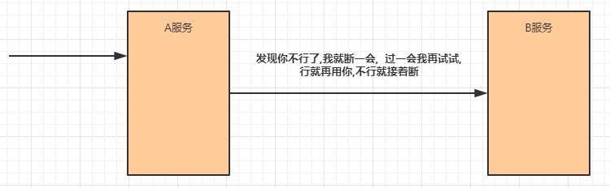
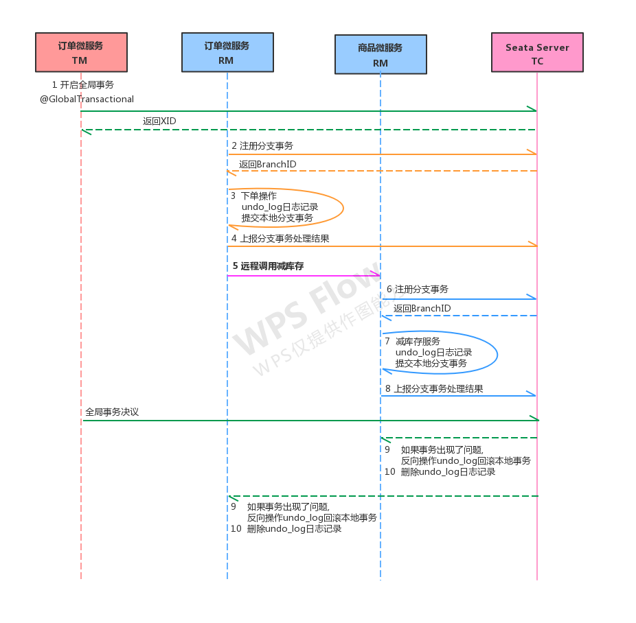

## SpringCloud Alibaba微服务笔记
  集中介绍`服务治理Nacos Discovery、负载均衡LoadBalance(Ribbon)、基于Feign(默认集成Ribbon)的服务调用、服务容错Sentinel、服务网关Gateway、链路追踪Sleuth（Zipkin）、消息驱动RocketMQ（Kafka、ActiveMQ、RabbitMQ、ZeroMQ等）、`
### 系统架构演变
系统架构经过了如下几个过程：
- 单体应用架构：
  
  - 特点：适用流量小的网站
  - 优点：
    - 项目架构简单，小型项目的话， 开发成本低
    - 项目部署在一个节点上， 维护方便
  - 缺点：
    - 全部功能集成在一个工程中，对于大型项目来讲不易开发和维护
    - 项目模块之间紧密耦合，单点容错率低
    - 无法针对不同模块进行针对性优化和水平扩展
- 垂直应用架构

  - 优点：
    - 系统拆分实现了流量分担，解决了并发问题，而且可以针对不同模块进行优化和水平扩展
    - 一个系统的问题不会影响到其他系统，提高容错率
  - 缺点:
    - 系统之间相互独立， 无法进行相互调用
    - 系统之间相互独立， 会有重复的开发任务
- 分布式架构

  - 优点：
    - 抽取公共的功能为服务层，提高代码复用性
  - 缺点：
    - 系统间耦合度变高，调用关系错综复杂，难以维护
- SOA架构

  - 优点：
    - 使用注册中心解决了服务间调用关系的自动调节
  - 缺点：
    - 服务间会有依赖关系，一旦某个环节出错会影响较大( 服务雪崩 )
    - 服务关心复杂，运维、测试部署困难
- 微服务架构

  - 优点：
    - 服务原子化拆分，独立打包、部署和升级，保证每个微服务清晰的任务划分，利于扩展
    - 微服务之间采用Restful等轻量级http协议相互调用
  - 缺点：
    - 分布式系统开发的技术成本高（容错、分布式事务等）
### 微服务常见概念
#### 服务治理
    服务治理就是进行服务的自动化管理，其核心是服务的自动注册与发现
- **服务注册**：服务实例将自身服务信息注册到注册中心
- **服务发现**：服务实例通过注册中心，获取到注册到其中的服务实例的信息，通过这些信息去请求它们提供的服务
- **服务剔除**：服务注册中心将出问题的服务自动剔除到可用列表之外，使其不会被调用到
#### 服务调用

    在微服务架构中，通常存在多个服务之间的远程调用的需求。目前主流的远程调用技术有基于HTTP的RESTful接口以及基于TCP的RPC协议
- **REST(Representational State Transfer)**：一种HTTP调用的格式，更标准，更通用，无论哪种语言都支持http协议
- **RPC(Remote Promote Call)**：进程间通信方式。允许像调用本地服务一样调用远程服务，主要目标就是让远程服务调用更简单、透明
#### 服务网关
    API网关直面意思是将所有API调用统一接入到API网关层，由网关层统一接入和输出。一个网关的基本功能有：统一接入、安全防护、协议适配、流量管控、长短链接支持、容错能力。有了网关之后，各个API服务提供团队可以专注于自己的的业务逻辑处理，而API网关更专注于安全、流量、路由等问题

#### 服务容错

服务容错的三个核心思想是
- 不被外界环境影响
- 不被上游请求压垮
- 不被下游响应拖垮
#### 链路追踪
    对一次请求涉及的多个服务链路进行日志记录，性能监控即链路追踪
### 微服务架构常见解决方案
- ServiceComb

    Apache ServiceComb，前身是华为云的微服务引擎 CSE (Cloud Service Engine) 云服务，是全球首个Apache微服务顶级项目。它提供了一站式的微服务开源解决方案，致力于帮助企业、用户和开发者将企业应用轻松微服务化上云，并实现对微服务应用的高效运维管理。
- SpringCloud

    Spring Cloud是一系列框架的集合。它利用Spring Boot的开发便利性巧妙地简化了分布式系统基础设施的开发，如服务发现注册、配置中心、消息总线、负载均衡、断路器、数据监控等，都可以用Spring Boot的开发风格做到一键启动和部署。
- SpringCloud Alibaba
  
    Spring Cloud Alibaba 致力于提供微服务开发的一站式解决方案。此项目包含开发分布式应用微服务的必需组件，方便开发者通过 Spring Cloud 编程模型轻松使用这些组件来开发分布式应用服务。
  - 主要功能：
    - **服务限流降级**： 默认支持 WebServlet、WebFlux， OpenFeign、RestTemplate、Spring CloudGateway， Zuul， Dubbo 和 RocketMQ 限流降级功能的接入，可以在运行时通过控制台实时修改限流降级规则，还支持查看限流降级 Metrics 监控。
    - **服务注册与发现**：适配 Spring Cloud 服务注册与发现标准，默认集成了 Ribbon 的支持。
    - **分布式配置管理**：支持分布式系统中的外部化配置，配置更改时自动刷新。
    - **消息驱动能力**：基于 Spring Cloud Stream 为微服务应用构建消息驱动能力。
    - **分布式事务**：使用 @GlobalTransactional 注解， 高效并且对业务零侵入地解决分布式事务问题。
    - **阿里云对象存储（MINIO）**：阿里云提供的海量、安全、低成本、高可靠的云存储服务。支持在任何应用、任何时间、任何地点存储和访问任意类型的数据。
    - **分布式任务调度**：提供秒级、精准、高可靠、高可用的定时（基于 Cron 表达式）任务调度服务。同时提供分布式的任务执行模型，如网格任务。网格任务支持海量子任务均匀分配到所有Worker（schedulerx-client）上执行。
  - 组件：
    - Sentinel：把流量作为切入点，从流量控制、熔断降级、系统负载保护等多个维度保护服务的稳定性。
    - Nacos：一个更易于构建云原生应用的动态服务发现、配置管理和服务管理平台。
    - RocketMQ：一款开源的分布式消息系统，基于高可用分布式集群技术，提供低延时的、高可靠的消息发布与订阅服务。
    - Dubbo：Apache Dubbo™ 是一款高性能 Java RPC 框架。
    - Seata：阿里巴巴开源产品，一个易于使用的高性能微服务分布式事务解决方案。
    - Alibaba Cloud ACM：一款在分布式架构环境中对应用配置进行集中管理和推送的应用配置中心产品
    - Alibaba Cloud OSS
    - Alibaba Cloud SchedulerX：阿里中间件团队开发的一款分布式任务调度产品，提供秒级、精准、高可靠、高可用的定时（基于 Cron 表达式）任务调度服务。
    - Alibaba Cloud SMS
### 服务治理
#### 常见注册中心
- Zookeeper：zookeeper是一个分布式服务框架，是Apache Hadoop 的一个子项目，它主要是用来解决分布式应用中经常遇到的一些数据管理问题
- Eureka：Eureka是Springcloud Netflix中的重要组件，主要作用就是做服务注册和发现。
- Consul：Consul是基于GO语言开发的开源工具，主要面向分布式，服务化的系统提供服务注册、服务发现和配置管理的功能
- Nacos：负责服务注册发现和服务配置，acos=eureka+config
### 负载均衡
  Ribbon是Spring Cloud的一个组件， 它可以让我们使用一个注解就能轻松的搞定负载均衡；Ribbon内置了多种负载均衡策略,内部负载均衡的顶级接口为`com.netflix.loadbalancer.IRule`，具体的负载策略参考实现类
- 基于RestTemplate
  ```
    @Bean
    @LoadBalanced
    public RestTemplate restTemplate() {
      return new RestTemplate();
    }
  ```
- 基于Feign
  
  Feign是Spring Cloud提供的一个声明式的伪Http客户端， 它使得调用远程服务就像调用本地服务一样简单， 只需要创建一个接口并添加一个注解即可。Nacos很好的兼容了Feign， Feign默认集成了 Ribbon， 所以在Nacos下使用Fegin默认就实现了负载均衡的效果。
  ```
  //依赖
  <!--fegin组件-->
  <dependency>
  <groupId>org.springframework.cloud</groupId>
  <artifactId>spring-cloud-starter-openfeign</artifactId>
  </dependency>
  
  //启动类添加注解开启Feign
  @EnableFeignClients
  ```
### 服务容错
- 由于服务与服务之间的依赖性，故障会传播，会对整个微服务系统造成灾难性的严重后果，这就是服务故障的 “雪崩效应”

- 常见容错方案
  - **隔离**
    
    它是指将系统按照一定的原则划分为若干个服务模块，各个模块之间相对独立，无强依赖。当有故障发生时，能将问题和影响隔离在某个模块内部，而不扩散风险，不波及其它模块，不影响整体的系统服务。常见的隔离方式有：线程池隔离和信号量隔离
  
  - **超时**
  
    在上游服务调用下游服务的时候，设置一个最大响应时间，如果超过这个时间，下游未作出反应，就断开请求，释放掉线程。
  
  - **限流**
    
    限流就是限制系统的输入和输出流量已达到保护系统的目的。为了保证系统的稳固运行,一旦达到的需要限制的阈值,就需要限制流量并采取少量措施以完成限制流量的目的。
  
  - **熔断**

    在互联网系统中，当下游服务因访问压力过大而响应变慢或失败，上游服务为了保护系统整体的可用性，可以暂时切断对下游服务的调用。这种牺牲局部，保全整体的措施就叫做熔断。
    - 熔断关闭状态（Closed）：服务没有故障时，熔断器所处的状态，对调用方的调用不做任何限制
    - 熔断开启状态（Open）：后续对该服务接口的调用不再经过网络，直接执行本地的fallback方法
    - 半熔断状态（Half-Open）：尝试恢复服务调用，允许有限的流量调用该服务，并监控调用成功率。如果成功率达到预期，则说明服务已恢复，进入熔断关闭状态；如果成功率仍旧很低，则重新进入熔断关闭状态
  
  - **降级**

    降级其实就是为服务提供一个托底方案，一旦服务无法正常调用，就使用托底方案。
  

- 微服务集成Sentinel非常简单, 只需要加入Sentinel的依赖即可
```
  <dependency>
  <groupId>com.alibaba.cloud</groupId>
  <artifactId>spring-cloud-starter-alibaba-sentinel</artifactId>
  </dependency>
```
### 服务网关

    所谓的API网关，就是指系统的统一入口，它封装了应用程序的内部结构，为客户端提供统一服务，一些与业务本身功能无关的公共逻辑可以在这里实现，诸如认证、鉴权、监控、路由转发等等。

#### 业界比较流行的网关
- Ngnix+lua：使用nginx的反向代理和负载均衡可实现对api服务器的负载均衡及高可用；lua是一种脚本语言,可以来编写一些简单的逻辑, nginx支持lua脚本
- Kong
- Zuul：Netflix开源的网关，功能丰富，使用JAVA开发，易于二次开发 问题：缺乏管控，无法动态配置；依赖组件较多；处理Http请求依赖的是Web容器，性能不如Nginx
- **Spring Cloud Gateway**：Spring Cloud Gateway是Spring公司基于Spring 5.0，Spring Boot 2.0 和 Project Reactor 等技术开发的网关，它旨在为微服务架构提供一种简单有效的统一的 API 路由管理方式。
  - 优点：
    - 性能强劲：是第一代网关Zuul的1.6倍
    - 功能强大：内置了很多实用的功能，例如转发、监控、限流等
    - 设计优雅，容易扩展
  - 缺点：
    - 其实现依赖Netty与WebFlux，不是传统的Servlet编程模型，学习成本高
    - 不能将其部署在Tomcat、Jetty等Servlet容器里，只能打成jar包执行
    - 需要Spring Boot 2.0及以上的版本，才支持
#### Gateway核心架构
- 路由(Route) 是 gateway 中最基本的组件之一，表示一个具体的路由信息载体主要定义了下面的几个信息：
  - **id**：路由标识符，区别于其他 Route
  - **uri**：路由指向的目的地 uri，即客户端请求最终被转发到的微服务。
  - **order**：用于多个 Route 之间的排序，数值越小排序越靠前，匹配优先级越高。
  - **predicate**：断言的作用是进行条件判断，只有断言都返回真，才会真正的执行路由。
  - **filter**：过滤器用于修改请求和响应信息。
- 执行流程

  执行流程大体如下：
1. Gateway Client向Gateway Server发送请求
2. 请求首先会被HttpWebHandlerAdapter进行提取组装成网关上下文
3. 网关的上下文会传递到DispatcherHandler，它负责将请求分发给RoutePredicateHandlerMapping
4. RoutePredicateHandlerMapping负责路由查找，并根据路由断言判断路由是否可用
5. 如果过断言成功，由FilteringWebHandler创建过滤器链并调用
6. 请求会一次经过PreFilter--微服务--PostFilter的方法，最终返回响应
### 链路追踪
#### 常见链路追踪技术：
- cat：由大众点评开源，基于Java开发的实时应用监控平台，包括实时应用监控，业务监控
- zipkin：由Twitter公司开源，开放源代码分布式的跟踪系统，用于收集服务的定时数据，以解决微服务架构中的延迟问题，包括：数据的收集、存储、查找和展现。

  - Collector：收集器组件，它主要用于处理从外部系统发送过来的跟踪信息，将这些信息转换为Zipkin内部处理的 Span 格式，以支持后续的存储、分析、展示等功能。
  - Storage：存储组件，它主要对处理收集器接收到的跟踪信息，默认会将这些信息存储在内存中，我们也可以修改此存储策略，通过使用其他存储组件将跟踪信息存储到数据库中。
  - RESTful API：API 组件，它主要用来提供外部访问接口。
  - Web UI：UI 组件， 基于API组件实现的上层应用。
- pinpoint：韩国人开源的基于字节码注入的调用链分析，以及应用监控分析工具
- skywalking：SkyWalking是本土开源的基于字节码注入的调用链分析，以及应用监控分析工具。特点是支持多种插件，UI功能较强，接入端无代码侵入
- sleuth：SpringCloud 提供的分布式系统中链路追踪解决方案

### RocketMQ的架构及概念
#### MQ介绍
MQ（Message Queue）是一种跨进程的通信机制，用于传递消息。通俗点说，就是一个先进先出的数据结构。

#### MQ的应用场景
- 异步解耦

异步解耦是消息队列 MQ 的主要特点，主要目的是减少请求响应时间和解耦。主要的使用场景就是将**比较耗时而且不需要即时（同步）返回结果**的操作作为消息放入消息队列。

- 流量削峰

  流量削峰也是消息队列 MQ 的常用场景，一般在秒杀或团队抢购(高并发)活动中使用广泛。

#### 常见MQ产品
- ZeroMQ：号称最快的消息队列系统，尤其针对大吞吐量的需求场景。扩展性好，开发比较灵活，采用C语言实现，实际上只是一个socket库的重新封装，如果做为消息队列使用，需要开发大量的代码。ZeroMQ仅提供非持久性的队列，也就是说如果down机，数据将会丢失。
- RabbitMQ：使用erlang语言开发，性能较好，适合于企业级的开发。但是不利于做二次开发和维护。
- ActiveMQ：历史悠久的Apache开源项目。已经在很多产品中得到应用，实现了JMS1.1规范，可以和spring-jms轻松融合，实现了多种协议，支持持久化到数据库，对队列数较多的情况支持不好。
- RocketMQ：阿里巴巴的MQ中间件，由java语言开发，性能非常好，能够撑住双十一的大流量，而且使用起来很简单。
- Kafka：Kafka是Apache下的一个子项目，是一个高性能跨语言分布式Publish/Subscribe消息队列系统，相对于ActiveMQ是一个非常轻量级的消息系统，除了性能非常好之外，还是一个工作良好的分布式系统。
#### RocketMQ架构

- 整体可以分成4个角色，分别是：NameServer，Broker，Producer，Consumer
  - Broker(邮递员)：Broker是RocketMQ的核心，负责消息的接收，存储，投递等功能
  - NameServer(邮局)：消息队列的协调者，Broker向它注册路由信息，同时Producer和Consumer向其获取路由信息
  - Producer(寄件人)：消息的生产者，需要从NameServer获取Broker信息，然后与Broker建立连接，向Broker发送消息
  - Consumer(收件人)：消息的消费者，需要从NameServer获取Broker信息，然后与Broker建立连接，从Broker获取消息
  - Topic(地区)：用来区分不同类型的消息，发送和接收消息前都需要先创建Topic，针对Topic来发送和接收消息
  - Message Queue(邮件)：为了提高性能和吞吐量，引入了Message Queue，一个Topic可以设置一个或多个Message Queue，这样消息就可以并行往各个Message Queue发送消息，消费者也可以并行的从多个Message Queue读取消息
  - Message：Message 是消息的载体。
  - Producer Group：生产者组，简单来说就是多个发送同一类消息的生产者称之为一个生产者组。
  - Consumer Group：消费者组，消费同一类消息的多个 consumer 实例组成一个消费者组。
- 消息类型：
  - 可靠同步发送：同步发送是指消息发送方发出数据后，会在收到接收方发回响应之后才发下一个数据包的通讯方式。应用场景非常广泛，例如重要通知邮件、报名短信通知、营销短信系统等
  - 可靠异步发送：异步发送是指发送方发出数据后，不等接收方发回响应，接着发送下个数据包的通讯方式。发送方通过回调接口接收服务器响应，并对响应结果进行处理。一般用于链路耗时较长，对 RT 响应时间较为敏感的业务场景。
  - 单向发送：单向发送是指发送方只负责发送消息，不等待服务器回应且没有回调函数触发，即只发送请求不等待应答。适用于某些耗时非常短，但对可靠性要求并不高的场景，例如日志收集。

### 服务配置（Nacos Config）
#### 服务架构
配置中心的思路是：
- 首先把项目中各种配置全部都放到一个集中的地方进行统一管理，并提供一套标准的接口。
- 当各个服务需要获取配置的时候，就来配置中心的接口拉取自己的配置。
- 当配置中心中的各种参数有更新的时候，也能通知到各个服务实时的过来同步最新的信息，使之动态更新。

#### 常见服务配置中心
- Apollo：Apollo是由携程开源的分布式配置中心。特点有很多，比如：配置更新之后可以实时生效，支持灰度发布功能，并且能对所有的配置进行版本管理、操作审计等功能，提供开放平台API。
- Disconf：Disconf是由百度开源的分布式配置中心。它是基于Zookeeper来实现配置变更后实时通知和生效的
- SpringCloud Config：这是Spring Cloud中带的配置中心组件。它和Spring是无缝集成，使用起来非常方便，并且它的配置存储支持Git。不过它没有可视化的操作界面，配置的生效也不是实时的，需要重启或去刷新。
- Nacos：是SpingCloud alibaba技术栈中的一个组件，既可以作为服务配置中心，也可作为服务注册中心
#### Nacos Config配置
- 服务中添加Nacos配置依赖
```
<dependency>
  <groupId>com.alibaba.cloud</groupId>
  <artifactId>spring-cloud-starter-alibaba-nacos-config</artifactId>
</dependency>
```
- 在微服务中添加nacos config的配置
  
  **注意:不能使用原来的application.yml作为配置文件，而是新建一个bootstrap.yml作为配置文件**
```
配置文件优先级(由高到低):
  bootstrap.properties -> bootstrap.yml -> application.properties -> application.yml
  
  spring:
    application:
      name: nacos-config
    cloud:
      nacos:
        config:
          server-addr: 127.0.0.1:8848 #nacos中心地址
          file-extension: yaml # 配置文件格式
    profiles:
      active: dev # 环境标识
      
  Nacos配置中心配置列表进行新建的Data ID不能随便写，要跟配置文件中的对应，即${spring.application.name}-${spring-profiles}.${spring.cloud.nacos.config.file-extension}，在此处为：nacos-config-dev.yaml
```
- 配置文件：

- 开启配置的动态刷新功能
```
/**
 * @Author: Michael J H Duan
 * @Date: 2022-10-10
 * @Version: V1.0
 * @Description:
 */
@RestController
@RefreshScope //只需要在需要动态读取配置的类上添加此注解就可以
public class IndexController {

    @Value("${nacos.config.val}")
    private String nacosConfigVal;

    @GetMapping("/")
    public String index(){
        return nacosConfigVal;
    }
}
```
- 配置共享
  - 在nacos中定义一个DataID为all-service.yaml的配置，用于所有微服务共享
  ```
  spring:
    datasource:
      driver-class-name: com.mysql.jdbc.Driver
      url: jdbc:mysql:///springcloud_alibaba?serverTimezone=UTC&useUnicode=true&characterEncoding=utf-8&useSSL=true
      username: root
      password: root
    jpa:
      properties:
        hibernate:
          dialect: org.hibernate.dialect.MySQL5InnoDBDialect
            hbm2ddl:
              auto: update
    cloud:
      nacos:
        discovery:
          server-addr: 127.0.0.1:8848
  
    zipkin:
      # zipkin server的请求地址
      base-url: http://127.0.0.1:9411/
      # 让Nacos把他作为一个URL，而不要当成服务名
      discovery-client-enabled: false
  ```
  - 在nacos的中修改service-product.yaml中为下面内容
  ```
  server:
    port: 8081

  config:
    appName: product
  ```
  - 修改bootstrap.yaml
  ```
  spring:
    application:
      name: service-product
  cloud:
    nacos:
      config:
        server-addr: 127.0.0.1:8848 #nacos中心地址
        file-extension: yaml # 配置文件格式
        shared-dataids: all-service.yaml # 配置要引入的配置
        refreshable-dataids: all-service.yaml # 配置要实现动态配置刷新的配置
  profiles:
    active: dev # 环境标识
  ```
- Nacos的几个概念：
  - **命名空间(Namespace)**：命名空间可用于进行不同环境的配置隔离。一般一个环境划分到一个命名空间
  - **配置分组(Group)**：配置分组用于将不同的服务可以归类到同一分组。一般将一个项目的配置分到一组
  - **配置集(Data ID)**：在系统中，一个配置文件通常就是一个配置集。一般微服务的配置就是一个配置集

### 分布式事务-Seata
  分布式事务就是为了保证不同数据库的数据一致性
- 分布式事务三种角色：
  - AP：Application应用系统（微服务）
  - TM：Transaction Manager事务管理器（全局事务管理器）
  - RM：Resource Manager资源管理器（数据库）
- Seata主要三个组件：
  - TC：Transaction Coordinator 事务协调器，管理全局的分支事务的状态，用于全局性事务的提交和回滚
  - TM：Transaction Manager 事务管理器，用于开启、提交或者回滚全局事务
- RM：Resource Manager 资源管理器，用于分支事务上的资源管理，向TC注册分支事务，上报分支事务的状态，接受TC的命令来提交或者回滚分支事务

Seata的执行流程如下：
1. A服务的TM向TC申请开启一个全局事务，TC就会创建一个全局事务并返回一个唯一的XID
2. A服务的RM向TC注册分支事务，并将其纳入XID对应全局事务的管辖
3. A服务执行分支事务，向数据库做操作
4. A服务开始远程调用B服务，此时XID会在微服务的调用链上传播
5. B服务的RM向TC注册分支事务，并将其纳入XID对应的全局事务的管辖
6. B服务执行分支事务，向数据库做操作
7. 全局事务调用链处理完毕，TM根据有无异常向TC发起全局事务的提交或者回滚
8. TC协调其管辖之下的所有分支事务， 决定是否回滚
- 在微服务工程数据库中初始化Seata记录事务要用到的表
```sql
CREATE TABLE `undo_log`(
  `id` BIGINT(20) NOT NULL AUTO_INCREMENT,
  `branch_id` BIGINT(20) NOT NULL,
  `xid` VARCHAR(100) NOT NULL,
  `context` VARCHAR(128) NOT NULL,
  `rollback_info` LONGBLOB NOT NULL,
  `log_status` INT(11) NOT NULL,
  `log_created` DATETIME NOT NULL,
  `log_modified` DATETIME NOT NULL,
  `ext` VARCHAR(100) DEFAULT NULL,
  PRIMARY KEY (`id`),
  UNIQUE KEY `ux_undo_log` (`xid`, `branch_id`)
) ENGINE = INNODB AUTO_INCREMENT = 1 DEFAULT CHARSET = utf8;
```
- 使用Seata需要在分布式控制的微服务中引入相关依赖
```xml
<dependency>
  <groupId>com.alibaba.cloud</groupId>
  <artifactId>spring-cloud-starter-alibaba-seata</artifactId>
</dependency>
<dependency>
  <groupId>com.alibaba.cloud</groupId>
  <artifactId>spring-cloud-starter-alibaba-nacos-config</artifactId>
</dependency>
```
- Seata 是通过代理数据源实现事务分支的，所以需要配置 io.seata.rm.datasource.DataSourceProxy 的Bean，且是 @Primary默认的数据源，否则事务不会回滚，无法实现分布式事务
```java
@Configuration
public class DataSourceProxyConfig {
  @Bean
  @ConfigurationProperties(prefix = "spring.datasource")
  public DruidDataSource druidDataSource() {
    return new DruidDataSource();
  }
  @Primary
  @Bean
  public DataSourceProxy dataSource(DruidDataSource druidDataSource) {
    return new DataSourceProxy(druidDataSource);
  }
}
```
- 在微服务工程的resources下添加Seata的配置文件 registry.conf
```
registry {
  type = "nacos"
  nacos {
    serverAddr = "localhost"
    namespace = "public"
    cluster = "default"
  }
}
config {
  type = "nacos"
  nacos {
    serverAddr = "localhost"
    namespace = "public"
    cluster = "default"
  }
}
```
- 使用注解在微服务中进行全局事务开启`@GlobalTransactional`
- Seata运行流程分析：



